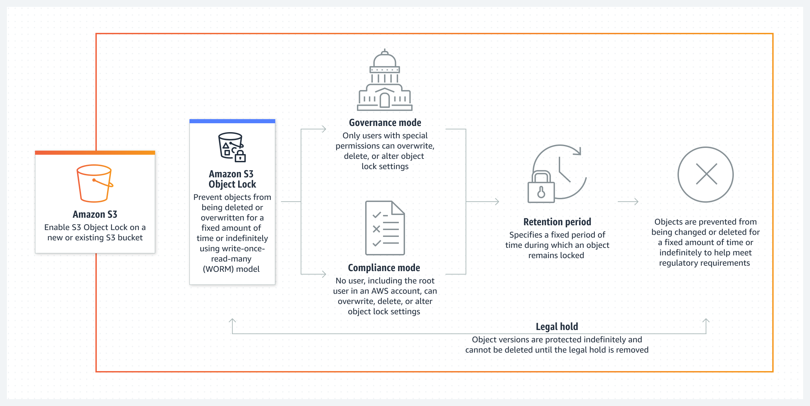

# AWS S3 Object-Lock

## Object Lock Summary
- Amazon S3 Object Lock provides protection against accidental or malicious deletions and overwrites, enforcing write once read many (WORM) policies, vital for compliance and regulatory requirements.

- Integration with S3 versioning ensures that protected object versions remain safe from deletion by lifecycle configurations, with the ability to replicate locked objects between buckets and manage object lock settings for billions of objects using batch operations.

- Object lock settings are applied at the individual object version level, allowing for customized retention periods and modes, including governance and compliance modes, as well as legal holds with no expiration date.

- Object lock is enabled at the bucket level, with the option to set default retention policies for all objects uploaded to the bucket, ensuring consistent protection.

- Attempts to delete protected objects are restricted based on the applied retention mode and legal holds, with compliance mode preventing deletion until the retention period elapses, while governance mode allows for deletion with special permissions, and legal holds override retention settings independently.

## Step-by-step Guide to use Object-Lock

**1.Enable Object Lock on a Bucket:**
- Open the AWS Management Console and navigate to the S3 service.
- Select the bucket for which you want to enable Object Lock.
- Choose the "Properties" tab and then select "Object lock".
- Click on "Edit" and enable Object Lock by selecting the option.
- Choose the desired default retention settings (either Governance or Compliance mode) or keep them as default.
- Save the changes.

**2. Upload Objects with Object Lock Settings:**
*Using AWS CLI:*

####  aws s3api put-object --bucket your-bucket-name --key your-object-key --body your-file.txt --object-lock-mode GOVERNANCE --object-lock-retain-until-date "2024-02-07T00:00:00Z"

- Replace "your-bucket-name", "your-object-key", "your-file.txt", and the date with your actual bucket name, object key, file name, and desired retention date.

**3. Manage Object Lock Settings:**
- To view the Object Lock configuration of a bucket:

#### aws s3api get-bucket-object-lock-configuration --bucket your-bucket-name

- To set Object Lock settings for an existing object:
#### aws s3api put-object-retention --bucket your-bucket-name --key your-object-key --retention-period '{"Days":365, "Mode":"GOVERNANCE"}'
- To put a legal hold on an object:
#### aws s3api put-object-legal-hold --bucket your-bucket-name --key your-object-key --legal-hold-status ON

**4.Delete Objects with Object Lock:**

- To delete an object, you must first remove any legal holds or wait until the retention period expires.
- Remove legal hold:

#### aws s3api put-object-legal-hold --bucket your-bucket-name --key your-object-key --legal-hold-status OFF

- After the legal hold is removed or the retention period expires, you can delete the object normally:

#### aws s3api delete-object --bucket your-bucket-name --key your-object-key

**5.Monitoring Object Lock Usage:**

You can monitor Object Lock usage through AWS CloudWatch metrics and set up alarms for specific events or thresholds.

## Descriptions and commands

| Command | Description |
|---------|-------------|
| `aws s3api put-object` | Uploads an object to an S3 bucket |
| `aws s3api put-object-retention` | Sets retention settings for an existing object |
| `aws s3api put-object-legal-hold` | Applies or removes a legal hold on an object |
| `aws s3api delete-object` | Deletes an object from an S3 bucket |
| `aws s3api get-bucket-object-lock-configuration` | Retrieves Object Lock configuration for a bucket |

# Resources
aws.amazon.com/s3/features/object-lock/