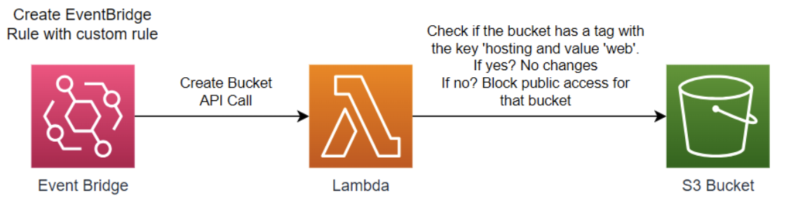

# [Resource Link: Lambda Functions](https://intuitive.cloud/blog/automated-s3-security-lambda-functions-to-the-rescue)



### Assets in AWS

**Lambda > Function:** [DetectPublicS3Buckets](https://us-east-1.console.aws.amazon.com/lambda/home?region=us-east-1#/functions/DetectPublicS3Buckets?tab=code)
**EventBridge > Rules:** [S3BucketRule](https://us-east-1.console.aws.amazon.com/events/home?region=us-east-1#/eventbus/default/rules/s3BucketRule)
**CloudWatch > Log Groups:** [/aws/lambda/DetectPublicS3Buckets](https://us-east-1.console.aws.amazon.com/cloudwatch/home?region=us-east-1#logsV2:log-groups/log-group/$252Faws$252Flambda$252FDetectPublicS3Buckets)
**KMS > Customer Managed Keys:** [s3bucket-monitor](https://us-east-1.console.aws.amazon.com/kms/home?region=us-east-1#/kms/keys/mrk-6c7a5c092a554326a520bde96aac692a)
**Amazon SNS > Topics > s3BucketMonitor:** [s3BucketMonitor](https://us-east-1.console.aws.amazon.com/sns/v3/home?region=us-east-1#/topic/arn:aws:sns:us-east-1:571355216739:s3BucketMonitor)


## Step-by-Step Guide to Set Up Lambda Functions

1. [Detect Public S3 Buckets](#detect-public-s3-buckets)

**EventBridge**: This service is used to set up a rule that triggers the Lambda function. The rule can be configured to respond to specific events, such as changes to S3 bucket settings.

**Create EventBridge Rule:**

- Go to the EventBridge console.
- Choose "Create rule".
- Set the rule type to "Event pattern".
- Select "AWS API Call via CloudTrail" and specify relevant S3 bucket events like "PutBucketAcl", "PutBucketPolicy", or "CreateBucket".
- Choose Lambda as the target and select the Lambda function (to be created next).

**Lambda Function**: This is where the logic for detecting public S3 buckets is implemented. The function can use AWS SDKs to inspect the configuration of S3 buckets and determine if they are publicly accessible.

**Create Lambda Function:**

- Open the Lambda console.
- Click "Create function".
- Write the function in Python. The code should use the Boto3 AWS SDK to list all S3 buckets and check each bucket's ACL and policy settings to determine if it's publicly accessible.
- Set the function to send an alert (e.g., via SNS or email) if a public bucket is detected.

**S3 Bucket**: While not directly part of the detection mechanism, an S3 bucket is involved as the target of the inspection. The Lambda function checks the configurations of S3 buckets to identify any that are publicly accessible.

**S3 Bucket Log Group was created automatically with the AWS Lambda Function.**

**Find the Log Group for your Lambda function in CloudWatch Logs:**

- Access CloudWatch: Go to the AWS Management Console and open the CloudWatch service.

- Navigate to Logs: In the CloudWatch dashboard, select "Logs" from the navigation pane.

- Search for Log Group: Look for a log group named `/aws/lambda/[your_lambda_function_name]`. This log group is automatically created by AWS Lambda for each function.

### Lambda Function Code for Detecting Public S3 Buckets

```python
import boto3
import json
from botocore.exceptions import ClientError

def lambda_handler(event, context):
    s3 = boto3.client('s3')
    sns = boto3.client('sns')
    public_buckets = []
    try:
        buckets = s3.list_buckets()['Buckets']
        for bucket in buckets:
            try:
                # Check ACL
                acl = s3.get_bucket_acl(Bucket=bucket['Name'])
                for grant in acl['Grants']:
                    if 'AllUsers' in grant['Grantee']:
                        public_buckets.append(bucket['Name'])

                # Check Bucket Policy
                policy = s3.get_bucket_policy(Bucket=bucket['Name'])
                if 'Public' in policy['Policy']:
                    public_buckets.append(bucket['Name'])
            except ClientError as e:
                print(f"Error checking bucket {bucket['Name']}: {e}")
    except ClientError as e:
        print(f"Error listing buckets: {e}")

    # Alert if public buckets found
    if public_buckets:
        alert_message = f"Public buckets found: {', '.join(public_buckets)}"
        print(alert_message)
        sns.publish(
            TopicArn='arn:aws:sns:region:account-id:topic-name',
            Message=alert_message,
            Subject='Public S3 Bucket Alert'
        )

    return {
        'statusCode': 200,
        'body': json.dumps('Lambda execution completed')
    }
```

### EventBridge Pattern for Public S3 Bucket Events

```json
{
  "source": ["aws.s3"],
  "detail-type": ["AWS API Call via CloudTrail"],
  "detail": {
    "eventSource": ["s3.amazonaws.com"],
    "eventName": ["PutBucketAcl", "PutBucketPolicy", "CreateBucket"]
  }
}
```