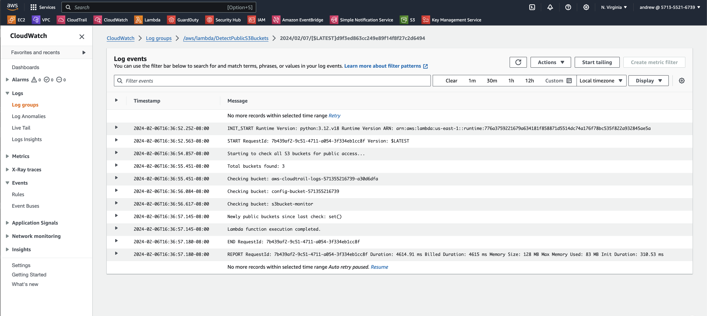

# [Resource Link: Lambda Functions](https://intuitive.cloud/blog/automated-s3-security-lambda-functions-to-the-rescue)


### Assets in AWS

**Lambda > Function:** [DetectPublicS3Buckets](https://us-east-1.console.aws.amazon.com/lambda/home?region=us-east-1#/functions/DetectPublicS3Buckets?tab=code)
**EventBridge > Rules:** [S3BucketRule](https://us-east-1.console.aws.amazon.com/events/home?region=us-east-1#/eventbus/default/rules/s3BucketRule)
**CloudWatch > Log Groups:** [/aws/lambda/DetectPublicS3Buckets](https://us-east-1.console.aws.amazon.com/cloudwatch/home?region=us-east-1#logsV2:log-groups/log-group/$252Faws$252Flambda$252FDetectPublicS3Buckets)
**KMS > Customer Managed Keys:** [s3bucket-monitor](https://us-east-1.console.aws.amazon.com/kms/home?region=us-east-1#/kms/keys/mrk-6c7a5c092a554326a520bde96aac692a)
**Amazon SNS > Topics > s3BucketMonitor:** [s3BucketMonitor](https://us-east-1.console.aws.amazon.com/sns/v3/home?region=us-east-1#/topic/arn:aws:sns:us-east-1:571355216739:s3BucketMonitor)

### Some Useful Commands

- `aws lambda list-functions --region us-east-1`
- `aws cloudtrail describe-trails`

## Step-by-Step Guide to Set Up Lambda Functions

1. [Detect Public S3 Buckets](#detect-public-s3-buckets)

**EventBridge**: This service is used to set up a rule that triggers the Lambda function. The rule can be configured to respond to specific events, such as changes to S3 bucket settings.

**Create EventBridge Rule:**

- Go to the EventBridge console.
- Choose "Create rule".
- Set the rule type to "Event pattern".
- Select "AWS API Call via CloudTrail" and specify relevant S3 bucket events like "PutBucketAcl", "PutBucketPolicy", or "CreateBucket".
- Choose Lambda as the target and select the Lambda function (to be created next).

**Lambda Function**: This is where the logic for detecting public S3 buckets is implemented. The function can use AWS SDKs to inspect the configuration of S3 buckets and determine if they are publicly accessible.

**Create Lambda Function:**

- Open the Lambda console.
- Click "Create function".
- Write the function in Python. The code should use the Boto3 AWS SDK to list all S3 buckets and check each bucket's ACL and policy settings to determine if it's publicly accessible.
- Set the function to send an alert (e.g., via SNS or email) if a public bucket is detected.

**S3 Bucket**: While not directly part of the detection mechanism, an S3 bucket is involved as the target of the inspection. The Lambda function checks the configurations of S3 buckets to identify any that are publicly accessible.

**S3 Bucket Log Group was created automatically with the AWS Lambda Function.**

**Find the Log Group for your Lambda function in CloudWatch Logs:**

- Access CloudWatch: Go to the AWS Management Console and open the CloudWatch service.

- Navigate to Logs: In the CloudWatch dashboard, select "Logs" from the navigation pane.

- Search for Log Group: Look for a log group named `/aws/lambda/[your_lambda_function_name]`. This log group is automatically created by AWS Lambda for each function.

Testing confirms Public buckets



### Lambda Function Code for Detecting Public S3 Buckets
**Lambda > Functions > DetectPublicS3Buckets (bucket name)**

```python
import boto3
import json
from botocore.exceptions import ClientError

# Global variable to track bucket states
previous_public_buckets = set()

def lambda_handler(event, context):
    global previous_public_buckets

    # Initialize AWS services
    s3 = boto3.client('s3')
    sns = boto3.client('sns')
    current_public_buckets = set()

    print("Starting to check all S3 buckets for public access...")

    try:
        buckets = s3.list_buckets()['Buckets']
        print(f"Total buckets found: {len(buckets)}")

        for bucket in buckets:
            bucket_name = bucket['Name']
            print(f"Checking bucket: {bucket_name}")

            try:
                # Check ACL
                acl = s3.get_bucket_acl(Bucket=bucket_name)
                for grant in acl['Grants']:
                    if 'AllUsers' in grant['Grantee']:
                        current_public_buckets.add(bucket_name)
                        print(f"Bucket {bucket_name} is public via ACL.")

                # Check Bucket Policy
                policy = s3.get_bucket_policy(Bucket=bucket_name)
                if 'Public' in policy['Policy']:
                    current_public_buckets.add(bucket_name)
                    print(f"Bucket {bucket_name} is public via Policy.")
            
            except ClientError as e:
                print(f"Error checking bucket {bucket_name}: {e}")

    except ClientError as e:
        print(f"Error listing buckets: {e}")

    # Find newly public buckets
    new_public_buckets = current_public_buckets - previous_public_buckets
    print(f"Newly public buckets since last check: {new_public_buckets}")

    # Update previous_public_buckets with the current state
    previous_public_buckets = current_public_buckets

    # Alert if new public buckets found
    if new_public_buckets:
        alert_message = f"Newly public buckets found: {', '.join(new_public_buckets)}"
        print(alert_message)

        try:
            sns_response = sns.publish(
                TopicArn='arn:aws:sns:us-east-1:**********39:s3BucketMonitor',
                Message=alert_message,
                Subject='Newly Public S3 Bucket Alert'
            )
            print(f"SNS alert sent. Response: {sns_response}")
        except ClientError as e:
            print(f"Error sending SNS alert: {e}")

    print("Lambda function execution completed.")
    return {
        'statusCode': 200,
        'body': json.dumps('Lambda execution completed')
    }
```

### EventBridge Pattern for Public S3 Bucket Events
**Amazon EventBridge > Rules > s3BucketRule**

```json
{
  "source": ["aws.s3"],
  "detail-type": ["AWS API Call via CloudTrail"],
  "detail": {
    "eventSource": ["s3.amazonaws.com"],
    "eventName": ["PutBucketAcl", "PutBucketPolicy", "CreateBucket"]
  }
}
```

### Key Management Service (KMS) Key Policy for Key ID: 
**KMS > Customer Managed Keys > Key ID:**

```json
{
    "Version": "2012-10-17",
    "Id": "key-consolepolicy-3",
    "Statement": [
        {
            "Sid": "Enable IAM User Permissions",
            "Effect": "Allow",
            "Principal": {
                "AWS": "arn:aws:iam::**********39:root"
            },
            "Action": "kms:*",
            "Resource": "*"
        },
        {
            "Sid": "Allow access for Key Administrators",
            "Effect": "Allow",
            "Principal": {
                "AWS": "arn:aws:iam::**********39:user/andrew"
            },
            "Action": [
                "kms:Create*",
                "kms:Describe*",
                "kms:Enable*",
                "kms:List*",
                "kms:Put*",
                "kms:Update*",
                "kms:Revoke*",
                "kms:Disable*",
                "kms:Get*",
                "kms:Delete*",
                "kms:TagResource",
                "kms:UntagResource",
                "kms:ScheduleKeyDeletion",
                "kms:CancelKeyDeletion",
                "kms:ReplicateKey",
                "kms:UpdatePrimaryRegion"
            ],
            "Resource": "*"
        },
        {
            "Sid": "Allow use of the key",
            "Effect": "Allow",
            "Principal": {
                "AWS": [
                    "arn:aws:iam::**********39:user/scotty",
                    "arn:aws:iam::**********39:user/eveangalina",
                    "arn:aws:iam::**********39:user/christen",
                    "arn:aws:iam::**********39:user/natali",
                    "arn:aws:iam::**********39:user/andrew",
                    "arn:aws:iam::**********39:user/renona"
                ]
            },
            "Action": [
                "kms:Encrypt",
                "kms:Decrypt",
                "kms:ReEncrypt*",
                "kms:GenerateDataKey*",
                "kms:DescribeKey"
            ],
            "Resource": "*"
        },
        {
            "Sid": "Allow attachment of persistent resources",
            "Effect": "Allow",
            "Principal": {
                "AWS": [
                    "arn:aws:iam::**********39:user/scotty",
                    "arn:aws:iam::**********39:user/eveangalina",
                    "arn:aws:iam::**********39:user/christen",
                    "arn:aws:iam::**********39:user/natali",
                    "arn:aws:iam::**********39:user/andrew",
                    "arn:aws:iam::**********39:user/renona"
                ]
            },
            "Action": [
                "kms:CreateGrant",
                "kms:ListGrants",
                "kms:RevokeGrant"
            ],
            "Resource": "*",
            "Condition": {
                "Bool": {
                    "kms:GrantIsForAWSResource": "true"
                }
            }
        },
        {
            "Sid": "Enable CloudTrail Encrypt Permissions",
            "Effect": "Allow",
            "Principal": {
                "Service": "cloudtrail.amazonaws.com"
            },
            "Action": [
                "kms:GenerateDataKey*",
                "kms:DescribeKey"
            ],
            "Resource": "*",
            "Condition": {
                "StringLike": {
                    "kms:EncryptionContext:aws:cloudtrail:arn": "arn:aws:cloudtrail:us-east-1:**********39:trail/s3Bucket"
                }
            }
        }
    ]
}
```